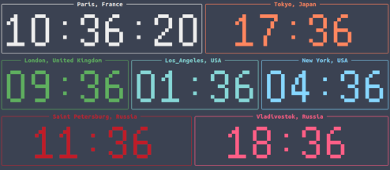

# world_clock

Displays basic world clock on a terminal.



## Usage
Just configure **clocks.yaml** the way you like it, then run
``` bash
# installing dependencies
pip install -r requirements.txt
# launch
python world_clock.py
```

## clocks.yaml
This file allows configuration of various clocks and their color / timezone.

You can add as many clocks as your screen/terminal can handle.

```yaml
paris:
    timezone:    'Europe/Paris'
    title:       'Paris, France'
    seconds:      True
    milliseconds: False
    color:        'red'
london: ...
```

- **timezone**: must be a pytz timezone (https://github.com/newvem/pytz/blob/master/pytz/locales/pytz.pot) 
- **title**: clock title
- **seconds**: wether or not seconds will be displayed on that clock
- **milliseconds**: wether or not milliseconds will be displayed on that clock
- **color**: clock color (https://rich.readthedocs.io/en/stable/appendix/colors.html#appendix-colors) 